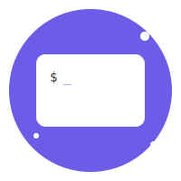

# 🌟 Partermai CLI

<div align="center">
  
  <br>
  <strong>Your Cozy Command-Line Home</strong>
  <br>
  <br>

[](https://www.rust-lang.org/)
[](https://opensource.org/licenses/MIT)
[](https://github.com/stumbdev/partermaicli)

</div>

## ✨ Features

### 🏠 Cozy Environment
- **Beautiful Interface**: Colorful, modern, and user-friendly design
- **Smart Prompt**: Shows current session and directory
- **Syntax Highlighting**: Makes commands more readable
- **Random Tips**: Learn something new every time!

### 🤖 Voia AI Assistant
- Integrated AI assistant powered by OpenAI
- Multiple AI models support (GPT-3.5, GPT-4)
- Maintains conversation context
- Customizable settings

### 📂 Session Management
- Create multiple named sessions
- Switch between sessions seamlessly
- Persistent command history
- Session-specific settings

### 🛠️ POSIX-like Commands
- `ls`: List directory contents
- `cd`: Change directory
- `pwd`: Print working directory
- `cat`: View file contents
- And more!

## 🚀 Quick Start

### Installation
```bash
# Clone the repository
git clone https://github.com/yourusername/partermai.git
cd partermai

# Build and install
cargo install --path .
```

### Basic Usage
```bash
# Start Partermai
partermai

# Create a new session
partermai new mysession

# Switch sessions
partermai switch mysession

# Get help
partermai help
```

### Using Voia AI Assistant
```bash
# Set your OpenAI API key
voia-setkey your-api-key-here

# Choose AI model
voia-model gpt-4

# Ask Voia something
voia what is the meaning of life?

# Clear conversation history
voia-clear
```

## 📚 Documentation

Visit our [documentation website](https://yourusername.github.io/partermai) for:
- Detailed guides
- Command reference
- Configuration options
- Examples and tutorials

## 🎨 Customization

Partermai is highly customizable:
- Change color schemes
- Configure AI models
- Customize prompt format
- Add your own commands

## 🤝 Contributing

We welcome contributions! See our [Contributing Guide](CONTRIBUTING.md) for details.

1. Fork the repository
2. Create your feature branch
3. Commit your changes
4. Push to the branch
5. Open a Pull Request

## 📜 License

This project is licensed under the MIT License - see the [LICENSE](LICENSE) file for details.

## 🌟 Acknowledgments

- Rust Community
- OpenAI for the amazing GPT models
- All our contributors

---

<div align="center">
  Made with ❤️ by the Partermai Team
  <br>
  <a href="https://github.com/yourusername/partermai">GitHub</a> •
  <a href="https://yourusername.github.io/partermai">Documentation</a> •
  <a href="https://github.com/yourusername/partermai/issues">Issues</a>
</div>
